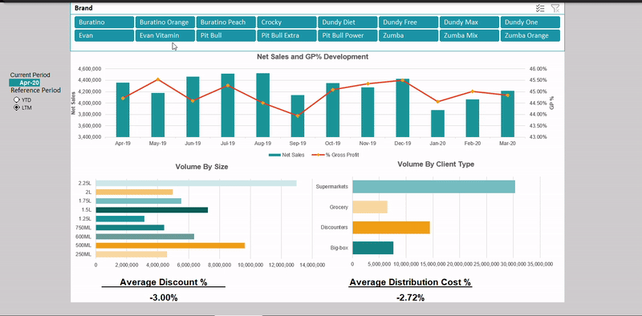

# Beverage Distributor Sales Dashboard

## Overview

This Excel dashboard provides a visual overview of key sales metrics for a beverage distributor, enabling data-driven decision-making.  Created as a practical exercise to explore sales trends in a mock ERP system scenario, this dashboard offers a user-friendly interface to analyze performance and identify key insights.

## Key Features

*   **Net Sales and GP% Development:** Track the trends of Net Sales and Gross Profit Percentage over time using a combined line and bar chart.
*   **Volume Analysis by Size:** Understand product performance by volume sold, broken down by size with a horizontal bar chart.
*   **Volume Analysis by Client Type:** Analyze sales volume based on different client types (e.g., Supermarket, Grocery, Big-box) using a horizontal bar chart.
*   **Average Discount & Distribution Cost:**  Quickly view the average discount rate applied and the average distribution cost as key performance indicators displayed as text metrics.
*   **Interactive Brand Filtering:** Utilize slicers to dynamically filter the dashboard data by specific beverage brands.
*   **Period Selection:** Easily switch between Year-to-Date (YTD) and Last Twelve Months (LTM) views using a dropdown menu and intuitive buttons, allowing for flexible period analysis.

## Insights

This dashboard is designed to help users:

*   **Identify top-selling products** based on volume and revenue.
*   **Understand Gross Profit performance** and identify areas for improvement.
*   **Analyze sales trends** over different time periods (YTD and LTM).
*   **Gain insights into client type performance** and tailor sales strategies accordingly.
*   **Monitor average discount and distribution costs** to optimize pricing and logistics.

## Data Source

The data used in this dashboard is based on publicly available information from a beverage distributor's ERP system.  This data has been heavily modified and anonymized to create a realistic mock dataset for demonstration and learning purposes.

The dataset includes the following key data points:

*   Month, Year, Date
*   Current Year, YTD, LTM Flags
*   Material Number & Description (Product Information)
*   Period (Month/Year)
*   Brand, Size, Pack
*   Client, Client Type
*   Volume (Units Sold)
*   Gross Sales, Discounts, Net Sales
*   Cost of Goods Sold
*   Distribution Costs
*   Warehousing Costs

## Technical Aspects

This dashboard is built using Microsoft Excel and leverages the following features:

*   **Pivot Tables:**  Used extensively to aggregate and summarize the raw data for analysis.
*   **Pivot Charts:**  Employed to create dynamic and interactive visualizations of key metrics.
*   **Data Validation:**  Utilized to create dropdown menus for period selection and ensure data integrity.
*   **Formulas:**  Various Excel formulas were used for calculations and data manipulation to derive key metrics and prepare data for visualization.

## How to Use

1.  **Download the Excel file** (e.g., `Beverage_Sales_Dashboard.xlsx`) from this repository.
2.  **Open the file in Microsoft Excel.**
3.  **Navigate through the different sheets** of the workbook to explore the dashboard and underlying data.
4.  **Use the slicers** located on the dashboard to filter data by brand.
5.  **Utilize the dropdown menu and buttons** to switch between Year-to-Date (YTD) and Last Twelve Months (LTM) views.
6.  **Interact with the charts and tables** to gain insights into the beverage distributor's sales performance.

## Software Requirements

*   Microsoft Excel (Generally compatible with recent versions)